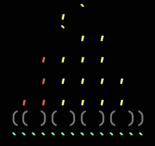

# campfire-cli

> Create a campfire in your terminal (with optional campfire soundscape).

## Requirements

- Python 3

## Install

```sh
$ git clone git@github.com:mhborthwick/campfire-cli.git

$ cd campfire-cli

# Create a virtual environment (Optional, but recommended).
$ python -m venv venv

# On Linux or Mac:
$ source venv/bin/activate

# On Windows:
$ .\venv\Scripts\activate

$ pip install -r requirements.txt

# If you used a virtual environment, deactivate it when you're done.
$ deactivate
```

## Usage

```sh
$ python src/main.py
```

## Options

#### --sound

Enable campfire soundscape [default: no-sound].

#### --verbose

Display campfire soundscape on/off message [default: verbose].

#### --help

Show help message and exit.

## Testing

```sh
$ pytest
```

## Credit

Campfire soundscape from [patches.zone](https://patches.zone/scenes/campfire).
